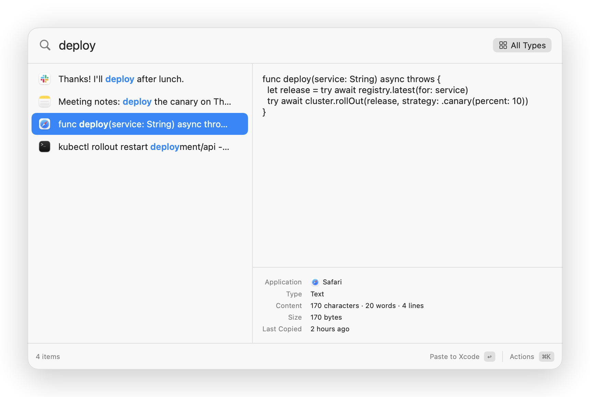

<p align="center">
  
</p>

<h1 align="center">Maccy</h1>

<p align="center">A fast, private clipboard manager for macOS.</p>

<p align="center">
  <a href="#install">Install</a> ·
  <a href="#features">Features</a> ·
  <a href="#keyboard">Keyboard</a> ·
  <a href="#privacy">Privacy</a>
</p>

<p align="center">
  <picture>
    <source media="(prefers-color-scheme: dark)" srcset="docs/images/panel-dark.png">
    
  </picture>
</p>

Maccy keeps everything you copy and brings it back in a few keystrokes. This fork of [p0deje/Maccy](https://github.com/p0deje/Maccy) is a rewrite with a two-pane panel, full-text search over a long history, and no third-party code.

## Install

Requires macOS 26 or later on Apple silicon. On first start, grant **Accessibility** (on macOS 27: **Device Control and Data Access**) so Maccy can paste into other apps.

### Download

1. Download `Maccy-<version>-arm64.zip` from the [latest release](https://github.com/pgilad/Maccy/releases/latest). Open it and move **Maccy** to **Applications**.
2. Open Maccy. macOS blocks the first start, because the app is not notarized. Go to **System Settings → Privacy & Security** and click **Open Anyway**.

To update, replace the app with a newer release. **Check for Updates…** in the menu bar menu tells you when a new release is out. All releases are signed with the same certificate, so macOS keeps the Accessibility permission.

### Build from source

Requires the Command Line Tools (`xcode-select --install`). Xcode is not needed.

```fish
git clone https://github.com/pgilad/Maccy.git
cd Maccy
make signing-identity   # once per Mac
make install            # build, sign, copy to /Applications and start
```

`make signing-identity` creates a local code-signing certificate, so macOS keeps the Accessibility permission after each rebuild.

To update, run `git pull` and `make install`.

## Features

- Search everything you copy: text, rich text, links, colors, images and files. Search reads the whole item, ignores case and accents, and ranks the results.
- Find text in screenshots with on-device OCR.
- Preview the full item with its source app, size and copy times.
- Filter with <kbd>⌘P</kbd>, or type `type:image`, `app:slack`, `is:pinned`, `"exact phrase"` or `/regex/`.
- Press <kbd>⌘K</kbd> for every action: paste as plain text, edit, open, show in Finder, save image, pin or delete.
- Pin items to keep them on top and safe from cleanup.
- Keep history by age, item count or total size. Search stays fast with 100,000 items.
- Pause capture from the menu bar icon.

## Keyboard

| Key | Action |
| --- | --- |
| <kbd>⇧⌘C</kbd> | Open Maccy (change it in Settings) |
| <kbd>C</kbd> again, modifiers held | Select the next item, release to paste it |
| <kbd>↑</kbd> <kbd>↓</kbd> | Move the selection |
| <kbd>↩</kbd> | Paste into the active app |
| <kbd>⌘↩</kbd> | Copy only |
| <kbd>⌥↩</kbd> | Paste as plain text |
| <kbd>⌘1</kbd> – <kbd>⌘9</kbd> | Paste one of the first nine items |
| <kbd>⌘K</kbd> | All actions, with their shortcuts |
| <kbd>⎋</kbd> | Clear the search, then close |

Settings can swap <kbd>↩</kbd> and <kbd>⌘↩</kbd>. If the shortcut does not work in a password field, see [this note](docs/keyboard-shortcut-password-fields.md).

## Privacy

- No telemetry and no auto-updater. The only network request is the update check: once a day, and when you choose **Check for Updates…**, Maccy asks the GitHub API for the latest release. It sends nothing about you or your history. To turn off the daily check, go to **Settings → Advanced**. The app links only Apple frameworks.
- Copies that password managers mark as concealed are never read, and password managers are ignored by default.
- Copies that look like API keys, tokens or private keys are deleted after 15 minutes, or not saved at all.
- Nothing you copy goes to logs or notifications.
- The App Sandbox is on. History stays in the app container and out of Time Machine, and deleted items are overwritten in the database.

## About this fork

This fork started from [Maccy](https://github.com/p0deje/Maccy) by Alexey Rodionov and is now a rewrite on SQLite with a full-text index. It drops Sparkle auto-update, App Store prompts, copy notifications, App Intents, translations and all third-party Swift packages. Its bundle ID is `com.pgilad.Maccy`, so it does not share data or permissions with upstream Maccy.

## Development

```fish
make test           # unit tests
make self-test      # capture, search and paste on a private pasteboard
make lint           # SwiftLint (brew install swiftlint)
make run            # debug build with a throwaway data folder
make readme-images  # render the screenshots above from the app's own views
```

To release, set the new version in `VERSION`, commit, and push a matching tag. The release workflow tests, builds and signs the app, then publishes the zip with build provenance. The release notes list the commits since the previous tag, without the `Release` commits.

```fish
echo 3.0.2 > VERSION
git commit -am "Release 3.0.2"
git tag -a v3.0.2 -m "Maccy 3.0.2"
git push origin main v3.0.2
```

## License

MIT. See [LICENSE](LICENSE).
